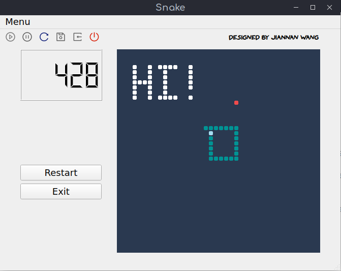
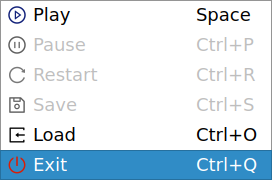
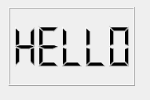
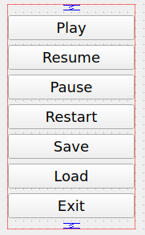
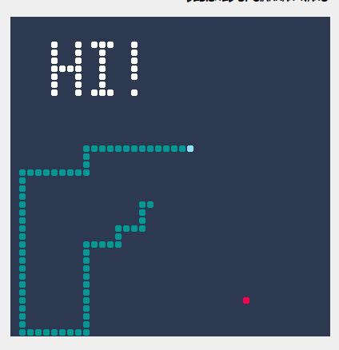
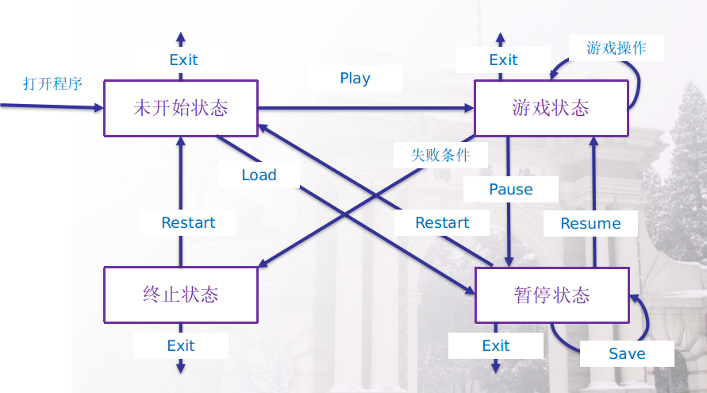
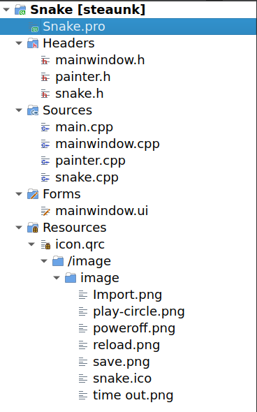

## 简述

本款游戏是贪吃蛇游戏，贪吃蛇在 $40\times 40$ 的网格上进行游戏，在未开始时用户还可通过点击空白网格，自行添加障碍。此外还在游戏界面上实现了开始游戏、暂停游戏、继续游戏、重新开始、退出游戏、保存游戏、载入游戏的功能。

## 游戏界面

如上图，从左到右，从上到下，分别是菜单栏，工具栏，署名栏，计时器，按钮功能区，游戏地图。

### 菜单栏

每个不同的操作有不同的图标及快捷键。在不同游戏状态下，不可用的操作会被禁用，如图中灰色部分。

### 工具栏

每个不同的操作有不同的图标。在不同游戏状态下，不可用的操作会被禁用，如图中灰色部分。

### 计时器

计时器在窗口开启时被设置为"Hello"，游戏开始时清零，并随着贪吃蛇的移动，时间不断增加。

### 按钮功能区

设置了 7 个按钮，对应着不同的操作，自动居中。在不同游戏状态下，显现给玩家不同的按钮。

### 游戏地图

地图大小 $40\times 40$。深蓝色为地图背景色，白色为障碍，天蓝色为蛇头，青绿色为蛇身，红色为食物。

## 游戏设计

### 游戏流程

流程设计基本与大作业PPT中的相符，设定了四个不同的游戏状态，不同的游戏状态中，菜单栏、工具栏中可用的操作不同，按钮功能区中显示的按钮也不同，且对应的游戏地图也不同。

### 程序设计

#### mainwindow.* 

主要管理整个游戏的逻辑

#### snake.*

负责蛇的移动、成长、吃食物、判断是否蛇死亡，游戏开始蛇的随机生成、每次食物的随机生成。
#### painter.*

负责绘制游戏地图。

## All Classes

查看同目录下的 [refman.pdf](./refman.pdf)

## Others

这里是一些其他内容

- 长按方向键可加速
- 自制了简陋应用图标 snake.ico

