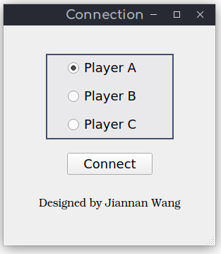
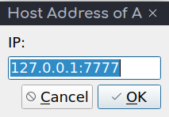
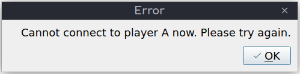
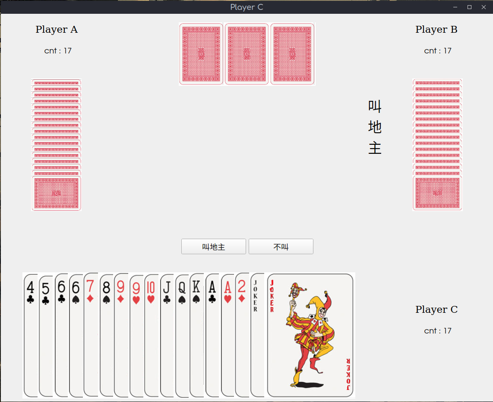
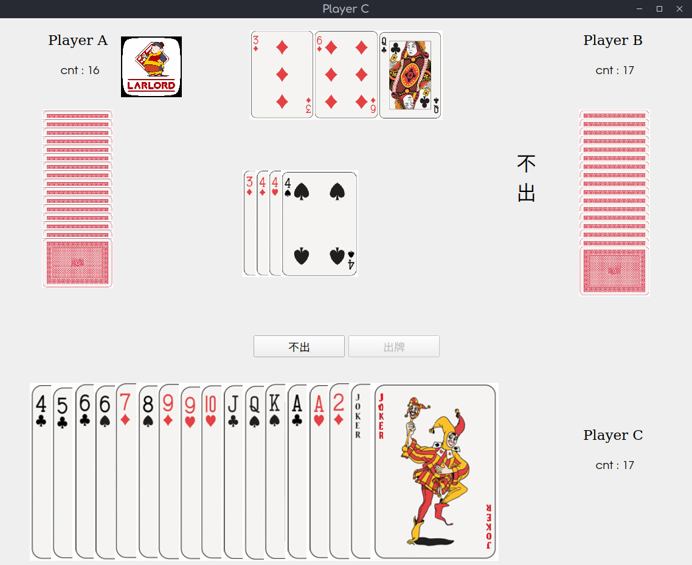
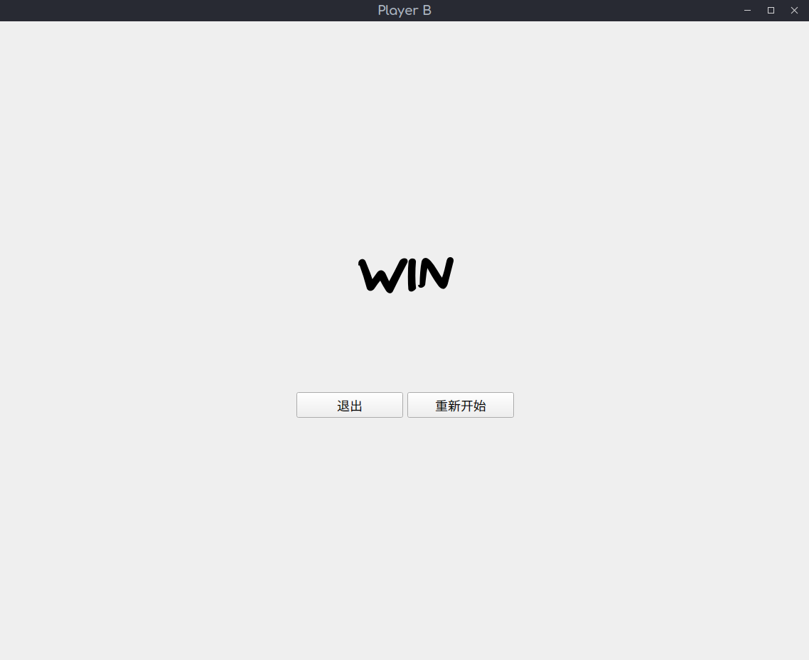
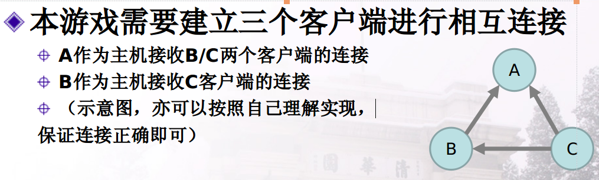

## 程序设计

### 启动程序

`./poker [12] [A-C]`

`[12]`：也可以选择空，即进入非测试模式，需选择玩家和输入 IP；`1` 和 `2` 均为测试模式，其后需跟上 `[A-C]` 表示选择玩家的编号，进入后无需选择玩家，`2` 还会自动连接。

### 准备界面

这是准备界面，其中上面是一个单选框，选择不同玩家对应的通信策略不同，也可以通过编译参数来选择。中间的是 connect 按钮，点击后输入IP或直接开始连接。下面是一个 label。

非测试模式下，点击按钮后需输入 IP

若连接失败，会跳出提示框

### 游戏界面

双方连接完毕后，进入游戏界面，此时会有斗地主专属音乐循环响起。游戏界面主要有四大区域：己方区域、下家信息区、上家信息区、公共区域。

#### 己方区域

位于下方，从上到下分别是：

- 状态栏：叫地主、不叫、不出

- 按钮区：叫地主、不叫、不出、出牌、退出、重新开始。不同状态下显示及可用按钮不同
- 手牌区：展示手牌
- 信息栏：玩家名称、剩余手牌数、地主标记

#### 下家信息区

位于左侧，从上到下分别是：

- 信息栏：玩家名称、剩余手牌数、地主标记
- 手牌区：展示手牌数相同的牌背
- 状态栏：叫地主、不叫、不出

#### 上家信息区

位于右侧，同“下家信息区”

#### 公共区域

位于中上，为所有玩家共同可见，从上到下分别是：

- 地主牌：显示地主牌，地主未确定时为牌面向下，确定后牌面向上
- 出牌区：显示玩家打出的牌
- 胜负标识：游戏结束时在画面中央显示 WIN 或 LOSE，并配上相应的音乐

## 客户端工作流程

客户端连接方式与 PPT 中所给相同。

用户在进入准备界面时需选择 $A$、$B$、$C$，或者也可以用编译命令。

若选择 $A$ 则会主动开启两个 TcpServer 等待连接；选择 $B$ 会开启一个 TcpServer，另一个为 TcpSocket 与 $A$ 连接；选择 $C$ 则会分别启动两个 TcpSocket 与 $A$、$B$ 连接，TcpSocket 连接成功后，TcpServer 将会关闭。

具体代码可查看 poker 目录下的 Server.h & Server.cpp

## 通信协议

每段信息均由以下四部分组成：`[发送方][信息类型][信息内容]$`。

- `[发送方]`：表明信息的发送者，值为 `[0-2]`，分别对应 $A,B,C$ 三名玩家。
- `[发送类型]`：表明信息的类型。

  - `S`：此玩家准备完毕
  - `A`：分发手牌，仅玩家 $A$ 可发送，后接若干手牌信息
  - `0`：分发地主牌，仅玩家 $A$ 可发送，后接若干地主牌信息
  - `T`：指定该局游戏玩家顺序，仅玩家 $A$ 可发送，后接数字表示玩家顺序
  - `Y`：叫地主或不叫，后接 `[YN]`
  - `L`：指定地主，仅一号玩家可发送，后接数字表示玩家的顺序
  - `P`：出牌，后接若干出牌信息
  - `R`：重新游戏
- `[信息内容]`：信息的主体部分，比如 `0PC4D4H4H=$'`，表示玩家 $A$ 出牌 $\clubsuit 4\diamondsuit4\heartsuit4\heartsuit K$。
  - 扑克：每张扑克信息都由两个字符组成
    - 非大小王： `[CDHS]` 分别表示花色，当 `[3-9:;<=>?]` 分别表 $3\sim K,A,2$
    - 小王：`J1`
    - 大王：`J2`
- `$`：结束标识，每次传递的信息结尾均需加上此符号。故在读取信息时用 `readAll()`，再用 `split('$')` 将信息进行分离后依次传回游戏中，从而避免粘包的问题。

## All Classes

详见同目录下 [refman.pdf](./refman.pdf)

## Other Feather

给游戏界面和失败胜利时均加了背景音乐，没有背景音乐的斗地主是没有灵魂的！